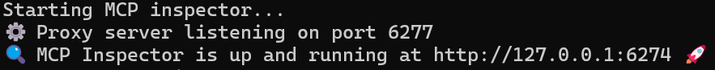

# Spring Boot Sample MCP Server

This is a sample implementation of a Model Context Protocol (MCP) server using Spring Boot. The server is designed to be
used with the Model Context Protocol Inspector for testing and debugging.
It provides a simple REST API to interact with the server and demonstrates how to set up a basic Spring Boot
application.
Unit tests are included to verify the functionality of the server.

## Table of Contents

- Requirements
- Configuration for e.g. Claude Desktop
- Development
    - Debugging
        - Install MCP Inspector
        - Run MCP Inspector for Testing
            - Build MCP Server
            - Run MCP Inspector

### Requirements

- Java 17+
- Maven
- MCP Inspector (optional for testing)

### Configuration for e.g. Claude Desktop

```json
{
  "mcpServers": {
    "sample-mcp-server": {
      "command": "java",
      "args": [
        "-jar",
        "sample-mcp-server-0.0.1-SNAPSHOT.jar",
        "--port",
        "8080",
        "--host",
        "localhost"
      ],
      "env": {
        "JAVA_TOOL_OPTIONS": "-agentlib:jdwp=transport=dt_socket,server=y,suspend=n,address=*:5005"
      }
    }
  }
}
```
Note: The `JAVA_TOOL_OPTIONS` environment variable is used to set the JVM options for remote debugging. The address and port can be changed as needed.

## Development

### Debugging

#### Install MCP Inspector

```bash
npm -g install @modelcontextprotocol/inspector
```

#### Run MCP Inspector for Testing

##### Build MCP Server

```bash
mvn clean package
```

##### Run MCP Inpsector

```bash
npx @modelcontextprotocol/inspector \
    -e JAVA_TOOL_OPTIONS=-agentlib:jdwp=transport=dt_socket,server=y,suspend=n,address=*:5005 \
    java -jar target/sample-mcp-server-<version>-SNAPSHOT.jar \
    --port 8080 --host localhost
```



Note: The `JAVA_TOOL_OPTIONS` environment variable is used to set the JVM options for remote debugging. The address and port can be changed as needed.

Now you can use the MCP Inspector to test and debug your Spring Boot MCP server. The inspector will provide a user-friendly interface (Browser) to interact with the server and visualize the data being exchanged.
The inspector can be used to send requests to the server, view the responses, and analyze the data flow between the client and server.
To debug the server, you can set breakpoints in your code and use the debugger in your IDE to step through the code and inspect variables.
Attach the debugger to the running server using the remote debugging options specified in the `JAVA_TOOL_OPTIONS` environment variable.
